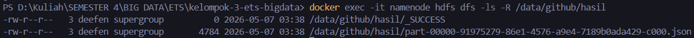
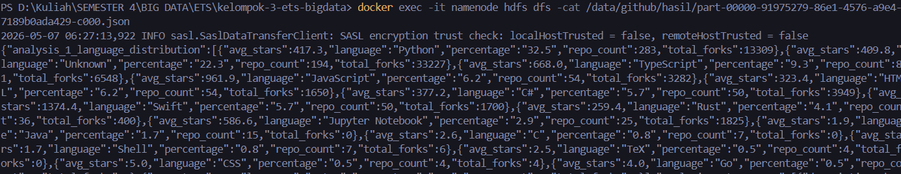
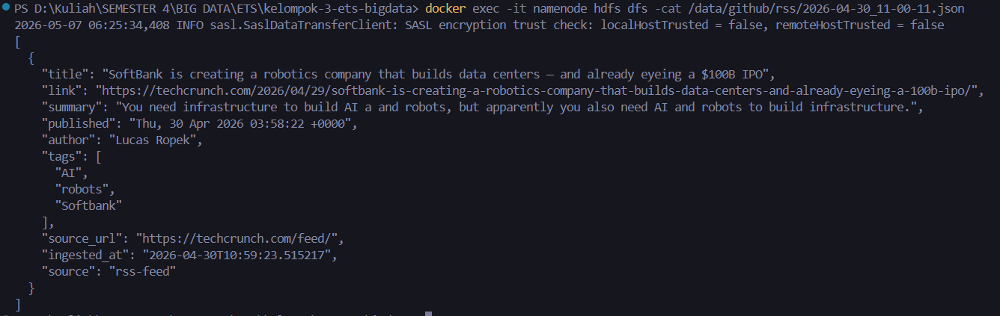
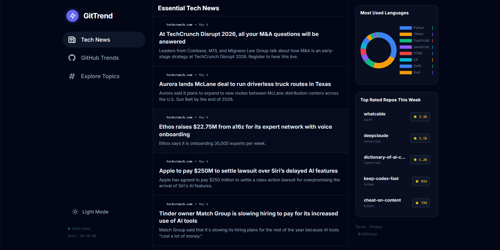
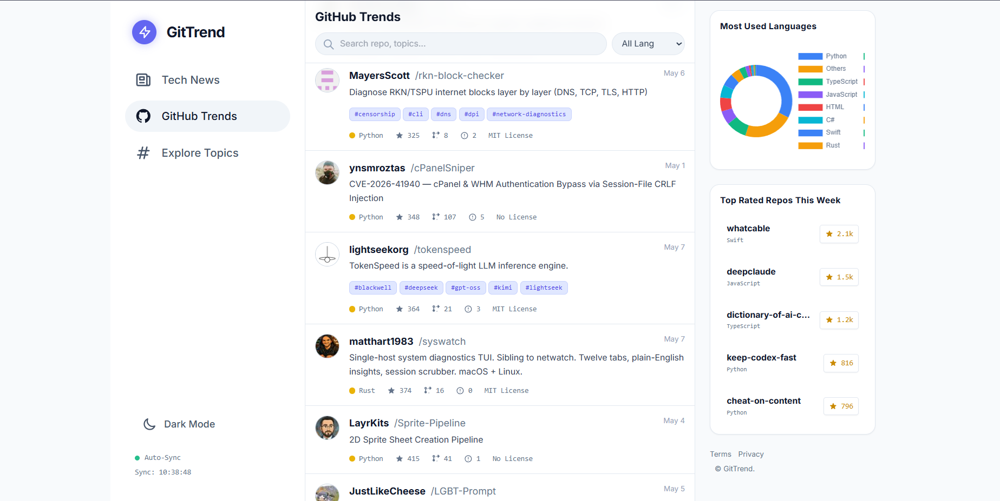
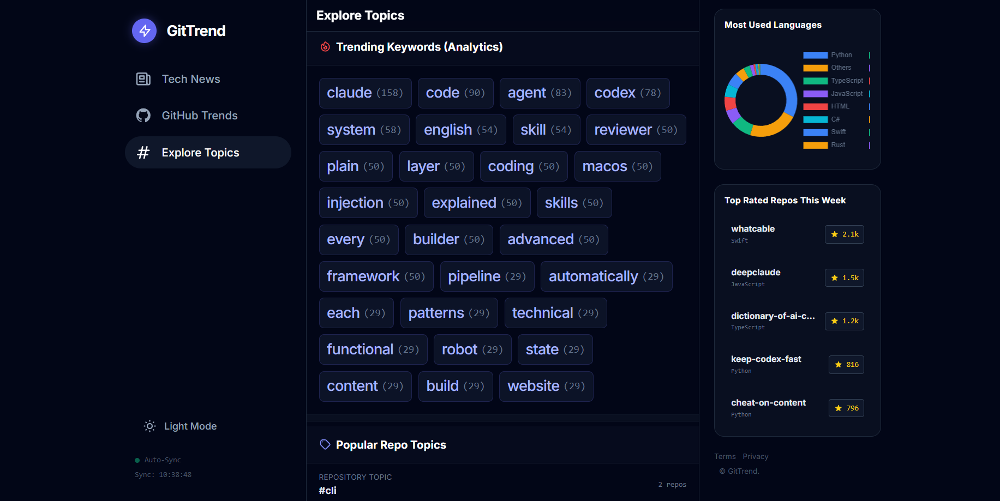
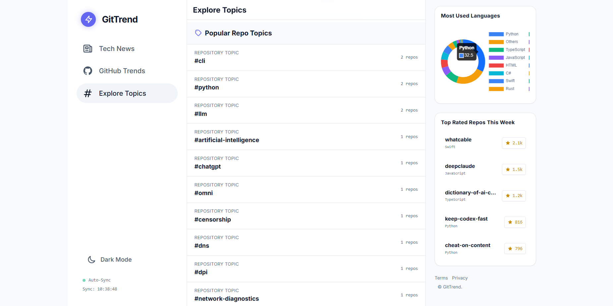

# GitTrend — Monitor Repositori Open Source Populer

Big Data Pipeline end-to-end: **Kafka → HDFS → Spark → Delta Lakehouse → Flask Dashboard**

> Pipeline streaming + batch yang memantau repositori GitHub trending dan berita teknologi (TechCrunch RSS), memprosesnya melewati arsitektur **Medallion (Bronze → Silver → Gold)** dengan Delta Lake, dan menyajikan hasilnya di dashboard Flask.

**Tech Stack:** Apache Kafka · Apache Hadoop (HDFS) · Apache Spark (PySpark) · Delta Lake · Flask · Docker · Python 3.9+

> 💡 **Resilient by design:** setiap tahap (ingest, analisis, lakehouse) mencoba HDFS terlebih dahulu lalu **otomatis fallback** ke file lokal / plain Python — jadi pipeline tetap jalan meski cluster Hadoop tidak aktif (mis. di laptop Windows).

```
GitHub API (60 detik)         TechCrunch RSS (5 menit)
       │                              │
       ▼                              ▼
 producer_api.py               producer_rss.py
       │                              │
       ▼                              ▼
 Kafka: github-api             Kafka: github-rss
       │                              │
       └──────────┬───────────────────┘
                  ▼
         consumer_to_hdfs.py
                  │
        ┌─────────┴─────────┐
        ▼                   ▼
  HDFS /data/github/   dashboard/data/
        │                   │
        ├───────────────────┤
        ▼                   ▼
  analysis.ipynb      01_bronze.py ──→ 🥉 Bronze Delta
  (Spark ETS)         02_silver.py ──→ 🥈 Silver Delta
        │             03_gold.py   ──→ 🥇 Gold Delta
        ▼                   │
  spark_results.json   gold_json/
        │                   │
        └─────────┬─────────┘
                  ▼
        Flask Dashboard :5000
       /api/data    /api/gold
```

---

## Daftar Isi

- [⚡ Quick Start (TL;DR)](#-quick-start-tldr)
- [Prasyarat](#prasyarat)
- [Step 0 — Setup Awal](#step-0--setup-awal)
- [Step 1 — Setup GitHub Token](#step-1--setup-github-token-opsional-disarankan)
- [Step 2 — Jalankan Docker Containers](#step-2--jalankan-docker-containers)
- [Step 3 — Jalankan Pipeline (3 Terminal)](#step-3--jalankan-pipeline-3-terminal)
- [Step 4 — Verifikasi Data](#step-4--verifikasi-data)
- [Step 5 — Spark Analysis (ETS)](#step-5--spark-analysis-ets)
- [Step 6 — Data Lakehouse (Medallion Architecture)](#step-6--data-lakehouse-medallion-architecture)
- [Step 7 — Flask Dashboard](#step-7--flask-dashboard)
- [Troubleshooting](#troubleshooting)
- [Struktur Project](#struktur-project)
- [Pembagian Tugas](#pembagian-tugas)
- [Menghentikan Semua Services](#menghentikan-semua-services)
- [Dokumentasi Hasil](#dokumentasi-hasil)

---

## ⚡ Quick Start (TL;DR)

Untuk yang sudah paham — alur lengkap dalam satu pandang (detail tiap langkah ada di section di bawah):

```bash
# 1. Setup environment
python -m venv venv
.\venv\Scripts\activate        # Windows  (source venv/bin/activate di macOS/Linux)
pip install kafka-python feedparser hdfs flask flask-cors requests python-dotenv pyspark==3.5.3 delta-spark==3.1.0

# 2. Infrastruktur (Docker)
docker-compose -f docker-compose-kafka.yml up -d
docker-compose -f docker-compose-hadoop.yml up -d
docker exec -it namenode hdfs dfs -mkdir -p /data/github/api /data/github/rss /data/github/hasil
docker exec -it namenode hdfs dfs -chmod -R 777 /data

# 3. Pipeline ingest — 3 terminal terpisah (venv aktif, di folder kafka/)
python producer_api.py         # Terminal 1 — GitHub API → Kafka
python producer_rss.py         # Terminal 2 — RSS → Kafka
python consumer_to_hdfs.py     # Terminal 3 — Kafka → HDFS + file lokal

# 4. Analitik
python spark/run_analysis.py   # ETS  : 3 analisis → dashboard/data/spark_results.json
python lakehouse/01_bronze.py  # Lakehouse: Bronze (raw + metadata)
python lakehouse/02_silver.py  #            Silver (cleaning + schema evolution)
python lakehouse/03_gold.py    #            Gold   (agregasi + time travel)

# 5. Dashboard
cd dashboard && python app.py  # http://localhost:5000
```

> **Tanpa Docker?** Lewati step 2 dan jalankan producer/consumer — pipeline analitik (`run_analysis.py` & lakehouse) otomatis fallback membaca dari `dashboard/data/*.json`.

---

## Prasyarat

| Tool             | Versi           |
| ---------------- | --------------- |
| Docker Desktop   | Latest          |
| Python           | **3.9 – 3.11** (hindari 3.12+ — lihat ⚠️) |
| Java             | 8 atau 11       |
| Git              | Latest          |
| winutils.exe     | Hadoop 3.3.x — **wajib di Windows untuk pipeline Lakehouse/Delta** |

> ⚠️ **Versi Python itu penting.** PySpark 3.5.3 hanya teruji untuk Python **3.8–3.11**. Di Python **3.12+ (terutama 3.14)**, operasi yang butuh serialisasi Python (UDF / RDD / `parallelize`) gagal dengan `RecursionError: Stack overflow` di cloudpickle — ini menggagalkan [`02_silver.py`](lakehouse/02_silver.py) (memakai UDF `parse_rfc2822`) dan langkah tulis-native di `run_analysis.py`. Untuk pipeline Lakehouse, pakai venv **Python 3.11**.
>
> 🪟 **Windows + Delta butuh `winutils.exe`.** Beda dari analisis ETS biasa (yang winutils-nya cuma warning), pipeline Lakehouse (Delta Lake) **wajib** `winutils.exe` + `HADOOP_HOME` di Windows. Setup ada di [Step 6 → Setup winutils.exe](#setup-winutilsexe-wajib-untuk-lakehouse-di-windows).

---

## Step 0 — Setup Awal
### 0a. Buat Virtual Environment & Install Dependencies

```bash
# Buat venv
python -m venv venv

# Aktifkan venv
.\\venv\\Scripts\\activate          # Windows PowerShell / CMD
# source venv/bin/activate          # macOS / Linux / Git Bash

# Install semua dependencies (ETS + Lakehouse)
pip install kafka-python feedparser hdfs flask flask-cors requests python-dotenv pyspark==3.5.3 delta-spark==3.1.0
```

> **Catatan Windows:** Untuk **analisis ETS** (`spark/run_analysis.py`), warning `HADOOP_HOME`/`winutils.exe` boleh **diabaikan** — Spark tetap jalan. **TAPI** untuk **pipeline Lakehouse/Delta** ([Step 6](#step-6--data-lakehouse-medallion-architecture)), `winutils.exe` **wajib** ada; tanpa itu `SparkContext` gagal init (`FileUtil.chmod` butuh winutils). Lihat [Setup winutils.exe](#setup-winutilsexe-wajib-untuk-lakehouse-di-windows). Meski mode `local[*]`, Delta tetap memakai Hadoop FileSystem lokal yang butuh winutils di Windows.

---

## Step 1 — Setup GitHub Token (Opsional, Disarankan)

Tanpa token, GitHub API rate limit = 10 request/jam. Dengan token = 30 request/jam.

1. Buka https://github.com/settings/tokens
2. Generate new token (classic) → centang `public_repo`
3. Buat file `.env` di root project:

```env
GITHUB_TOKEN=ghp_xxxxxxxxxxxxxxxxxxxx
```

---

## Step 2 — Jalankan Docker Containers

### 2a. Jalankan Kafka + Zookeeper

```bash
docker-compose -f docker-compose-kafka.yml up -d
```

Verifikasi:
```bash
docker ps
# Harus muncul: zookeeper, kafka-broker
```

### 2b. Jalankan Hadoop Cluster

```bash
docker-compose -f docker-compose-hadoop.yml up -d
```

Verifikasi:
```bash
docker ps
# Harus muncul: namenode, datanode, resourcemanager, nodemanager, historyserver
```

Tunggu ~30 detik sampai namenode ready, lalu cek Web UI: http://localhost:9870

### 2c. Buat Direktori HDFS

```bash
docker exec -it namenode hdfs dfs -mkdir -p /data/github/api
docker exec -it namenode hdfs dfs -mkdir -p /data/github/rss
docker exec -it namenode hdfs dfs -mkdir -p /data/github/hasil
docker exec -it namenode hdfs dfs -chmod -R 777 /data
```

Verifikasi:
```bash
docker exec -it namenode hdfs dfs -ls -R /data/
```

---

## Step 3 — Jalankan Pipeline (3 Terminal)

Buka **3 terminal terpisah**, aktifkan venv di masing-masing, lalu masuk ke folder `kafka/`:

```bash
.\\venv\\Scripts\\activate    # aktifkan venv di setiap terminal
cd kafka
```

### Terminal 1 — Producer API (GitHub)

```bash
python producer_api.py
```

Output yang diharapkan:
```
GitHub API Producer dimulai
Topic: github-api | Interval: 1 menit
Berhasil fetch 30 repo. Rate limit remaining: 29
Berhasil kirim 30/30 event ke topic 'github-api'
Menunggu 1 menit sebelum polling berikutnya...
```

> **Catatan Demo:** Interval saat ini diset **60 detik** agar data cepat masuk selama demo.

### Terminal 2 — Producer RSS (TechCrunch)

```bash
python producer_rss.py
```

Output yang diharapkan:
```
RSS Feed Producer dimulai
Topic: github-rss | Interval: 5 menit
Feed https://techcrunch.com/feed/: 20 total, 20 baru
Total 20 artikel baru dikirim ke 'github-rss'
```

> **Catatan:** Producer membaca dua feed — `techcrunch.com/feed/` (utama) dan `tekno.kompas.com/rss/` (cadangan). Artikel dideduplikasi via hash URL (in-memory), jadi polling berikutnya hanya mengirim artikel yang benar-benar baru.

### Terminal 3 — Consumer → HDFS

```bash
python consumer_to_hdfs.py
```

Output yang diharapkan:
```
Consumer HDFS dimulai
Topics: ['github-api', 'github-rss']
HDFS directory ready: /data/github/api
HDFS directory ready: /data/github/rss
Received 30 messages dari 'github-api'
Received 20 messages dari 'github-rss'
Flushed 30 events dari topic 'github-api'    ← (setelah 2 menit)
Flushed 20 events dari topic 'github-rss'
```

---

## Step 4 — Verifikasi Data

### 4a. Verifikasi Kafka Topics

```bash
# List semua topic
docker exec -it kafka-broker kafka-topics --list --bootstrap-server localhost:9092

# Baca data dari topic github-api
docker exec -it kafka-broker kafka-console-consumer --topic github-api --from-beginning --bootstrap-server localhost:9092

# Baca data dari topic github-rss
docker exec -it kafka-broker kafka-console-consumer --topic github-rss --from-beginning --bootstrap-server localhost:9092
```
Berikut isi dari direktori github/hasil


### 4b. Verifikasi Data di HDFS

```bash
# List file di HDFS
docker exec -it namenode hdfs dfs -ls -R /data/github/

# Baca isi salah satu file
docker exec -it namenode hdfs dfs -cat /data/github/api/<nama-file>.json

# Size per folder (api/, rss/, hasil/)
docker exec -it namenode hdfs dfs -du -h /data/github/

# Ringkasan kapasitas cluster (total, used, available)
docker exec -it namenode hdfs dfs -df -h /data/
```
Berikut isi file hasil.

Berikut merupakan sebagian dari isi file json data rss.


### 4c. Verifikasi File Lokal Dashboard

```bash
# Cek apakah file live data sudah ada
dir dashboard\data\
# Harus ada: live_api.json, live_rss.json
```

---

## Step 5 — Spark Analysis (ETS)

### Opsi A: Notebook PySpark (dengan HDFS)

Buka `spark/analysis.ipynb` di Jupyter Notebook atau Google Colab:

```bash
jupyter notebook spark/analysis.ipynb
```

- Membaca data dari HDFS
- 3 analisis wajib: distribusi bahasa, top 10 repo, kata trending
- Output: `dashboard/data/spark_results.json`

### Opsi B: Runner PySpark via Script

`run_analysis.py` menjalankan analisis PySpark yang sama, membaca langsung dari HDFS.
Jika PySpark gagal (misal di Windows), otomatis fallback ke plain Python.

```bash
# Jalankan sekali (baca dari HDFS)
python spark/run_analysis.py

# Mode watch — analisis diperbarui otomatis setiap 60 detik
python spark/run_analysis.py --watch 60

# Mode lokal — baca dari tmp/spark_staging/ (tanpa HDFS/Docker)
python spark/run_analysis.py --local

# Kombinasi watch + lokal
python spark/run_analysis.py --watch 60 --local
```

Output: `dashboard/data/spark_results.json` (juga di-upload ke HDFS `/data/github/hasil/` bila Docker aktif).

> Script mencoba PySpark native (`spark.read` dari HDFS) terlebih dahulu; jika gagal (mis. Java/Spark error di Windows) otomatis fallback ke **plain Python** yang tetap membaca HDFS via `docker exec` — atau ke staging lokal bila HDFS kosong.

### Opsi C: Docker Spark (Alternatif)

Jika ingin menjalankan Spark di dalam Docker container:

```bash
docker compose -f docker-compose-spark.yml up -d
docker exec spark-master spark-submit /opt/spark-apps/spark_analysis.py
```

---

## Step 6 — Data Lakehouse (Medallion Architecture)

> **📦 Fitur Baru:** Pipeline Data Lakehouse dengan arsitektur Medallion (Bronze → Silver → Gold) menggunakan Delta Lake. Dokumentasi teknis lengkap tersedia di [`lakehouse/README_lakehouse.md`](lakehouse/README_lakehouse.md).

### Arsitektur Medallion

```
HDFS / JSON Lokal
       │
       ▼
 🥉 Bronze Layer (01_bronze.py)
    ├── Raw data + metadata (_ingested_at, _source)
    └── Format: Delta Lake
       │
       ▼
 🥈 Silver Layer (02_silver.py)
    ├── 5 transformasi API: dedup, parse timestamp, handle null, ekstrak jam, standarisasi
    ├── 3 transformasi RSS: dedup, parse timestamp, handle null
    ├── Schema Evolution demo (mergeSchema)
    └── Format: Delta Lake
       │
       ▼
 🥇 Gold Layer (03_gold.py)
    ├── Analisis 1: Distribusi Bahasa (repro ETS)
    ├── Analisis 2: Top 10 Repo (repro ETS)
    ├── Analisis 3: Star Velocity (baru — Window function lag())
    ├── Analisis 4: Emerging Topics (baru — temporal keyword analysis)
    ├── Analisis 5: Cross-Source Topics (bonus — join API ↔ RSS)
    ├── Time Travel Demo (v0 → v1 → v2)
    └── Export: JSON untuk dashboard
```

### Prasyarat Khusus Lakehouse di Windows

Pipeline Delta Lake punya dua prasyarat tambahan di Windows yang **tidak** dibutuhkan analisis ETS biasa:

#### Setup winutils.exe (WAJIB untuk Lakehouse di Windows)

Tanpa ini, `python lakehouse/01_bronze.py` langsung gagal dengan:
`java.io.FileNotFoundException: HADOOP_HOME and hadoop.home.dir are unset` (di `Shell.getWinUtilsPath` → `FileUtil.chmod`).

Penyebab: `configure_spark_with_delta_pip` mendistribusikan JAR Delta lewat `SparkContext.addFile`, yang di Windows memanggil `chmod` → butuh `winutils.exe`. Operasi tulis Delta (`_delta_log`, atomic rename) juga butuh itu.

Langkah:

```powershell
# 1. Buat folder
mkdir C:\hadoop\bin

# 2. Download winutils.exe + hadoop.dll untuk Hadoop 3.3.x
#    Sumber komunitas: https://github.com/cdarlint/winutils  (folder hadoop-3.3.6/bin)
#    PySpark 3.5.3 membundel Hadoop 3.3.4 → binari 3.3.5/3.3.6 kompatibel.
#    Letakkan winutils.exe DAN hadoop.dll ke C:\hadoop\bin\
#    (salin juga hadoop.dll ke C:\Windows\System32\ untuk menghindari UnsatisfiedLinkError)

# 3. Set environment variable (permanen)
setx HADOOP_HOME "C:\hadoop"
setx PATH "$env:PATH;C:\hadoop\bin"

# 4. TUTUP & buka ulang terminal, aktifkan lagi venv, verifikasi:
#    echo $env:HADOOP_HOME   → C:\hadoop
#    winutils.exe ls         → tidak error
```

> Versi bundel Hadoop bisa dicek dari nama file di `venv\Lib\site-packages\pyspark\jars\hadoop-client-*.jar`.

#### Gunakan Python 3.11 (bukan 3.12+)

[`02_silver.py`](lakehouse/02_silver.py) memakai Python UDF (`parse_rfc2822`) yang butuh **cloudpickle**. Di Python 3.12+/3.14, cloudpickle PySpark 3.5.3 gagal `RecursionError: Stack overflow`. Buat venv khusus 3.11:

```powershell
py -3.11 -m venv venv311
.\venv311\Scripts\activate
pip install pyspark==3.5.3 delta-spark==3.1.0 kafka-python feedparser hdfs flask flask-cors requests python-dotenv
```

### Cara Menjalankan Lakehouse Pipeline

Jalankan dari **root project** (`kelompok-3-ets-bigdata/`):

```bash
# Pastikan venv aktif (idealnya venv Python 3.11 + HADOOP_HOME sudah di-set)
.\\venv311\\Scripts\\activate

# 1. Bronze: Ingest data mentah → Delta
python lakehouse/01_bronze.py

# 2. Silver: Cleaning + Transformasi + Schema Evolution
python lakehouse/02_silver.py

# 3. Gold: Agregasi + Analisis + Time Travel Demo
python lakehouse/03_gold.py
```

Setiap script akan print statistik dan hasil analisis ke terminal.

### Sumber Data

Pipeline mendukung **dua mode** (otomatis fallback):

| Mode | Sumber | Kapan |
|------|--------|-------|
| **HDFS** | `hdfs://namenode:8020/data/github/api/` dan `rss/` | Docker Hadoop berjalan |
| **Lokal** (fallback) | `dashboard/data/live_api.json` dan `live_rss.json` | HDFS tidak tersedia |

### Output Lakehouse

```
lakehouse/lakehouse_data/
├── bronze/
│   ├── github_api/     ← Raw data + metadata
│   └── github_rss/     ← Raw data + metadata
├── silver/
│   ├── github_api/     ← Cleaned + typed + schema evolved
│   └── github_rss/     ← Cleaned + typed
├── gold/
│   ├── language_dist/  ← Distribusi bahasa
│   ├── top_repos/      ← Top 10 repo
│   ├── star_velocity/  ← Deteksi repo viral
│   ├── emerging_topics/← Topik baru yang emerging
│   └── cross_source/   ← Cross-source join (bonus)
└── gold_json/          ← Export JSON untuk dashboard
```

### Fitur Lakehouse vs Pipeline ETS Lama

| Fitur | ETS Lama | Lakehouse Baru |
|-------|----------|----------------|
| Format penyimpanan | JSON mentah di HDFS | Delta Lake (ACID, versioned) |
| Schema | Tidak ada validasi | Enforcement + Evolution (`mergeSchema`) |
| Versioning | ❌ Data overwrite hilang | ✅ Time Travel (akses versi lama) |
| Audit trail | ❌ | ✅ Kolom `_ingested_at`, `_source` |
| Star Velocity | ❌ | ✅ Window function `lag()` |
| Emerging Topics | ❌ | ✅ Temporal keyword analysis |
| Cross-Source | ❌ | ✅ Join API topics ↔ RSS tags |

---

## Step 7 — Flask Dashboard

```bash
cd dashboard
python app.py
```

Buka browser: http://localhost:5000

### API Endpoints

| Endpoint | Sumber Data | Keterangan |
|----------|-------------|------------|
| `/api/data` | `spark_results.json`, `live_api.json`, `live_rss.json` | Endpoint ETS — dikonsumsi UI dashboard |
| `/api/gold` | `lakehouse/lakehouse_data/gold_json/*.json` | Endpoint baru (JSON) untuk data Gold Lakehouse |

> **Catatan:** Endpoint lama (`/api/data`) **tidak diubah sama sekali** dan menjadi sumber data UI dashboard. Endpoint `/api/gold` bersifat **additive** — saat ini disajikan sebagai JSON API (mis. diakses via browser/`curl http://localhost:5000/api/gold`) dan belum dirender di UI default; menghapusnya tidak mempengaruhi dashboard yang sudah ada. Jika Gold belum di-generate, endpoint mengembalikan pesan untuk menjalankan `python lakehouse/03_gold.py`.

---

## Troubleshooting

| Problem | Solusi |
|---------|--------|
| `NoBrokersAvailable` | (1) Pastikan Kafka container running: `docker ps`. (2) Jika container **sudah** running tapi tetap error dengan log `connecting to localhost:9092 [('::1', ...) IPv6]`, berarti `localhost` resolve ke IPv6 `::1` yang tidak dilayani broker — gunakan `127.0.0.1:9092` (bukan `localhost`) di config bootstrap. |
| IPv6 connection timeout | Semua client memakai `127.0.0.1` (IPv4), bukan `localhost`. Broker hanya meng-advertise `PLAINTEXT_HOST://127.0.0.1:9092`. |
| `Rate limit tercapai` | Tambahkan GitHub Token di file `.env` |
| HDFS upload gagal | Pastikan Hadoop containers running dan HDFS dirs sudah dibuat |
| `No module named 'kafka'` | `pip install kafka-python` |
| `No module named 'feedparser'` | `pip install feedparser` |
| Consumer tidak menerima data | Pastikan producer sudah mengirim data terlebih dahulu |
| `No module named 'delta'` | `pip install delta-spark==3.1.0` |
| `HADOOP_HOME` warning di `run_analysis.py` | Abaikan — analisis ETS tetap jalan tanpa winutils |
| `HADOOP_HOME and hadoop.home.dir are unset` (FATAL, di lakehouse) | Delta di Windows **wajib** `winutils.exe`. Install + set `HADOOP_HOME` → [Setup winutils.exe](#setup-winutilsexe-wajib-untuk-lakehouse-di-windows) |
| `RecursionError: Stack overflow` / `Could not serialize object` | Python 3.12+ tidak kompatibel dengan cloudpickle PySpark 3.5.3. Pakai venv **Python 3.11** (memengaruhi `02_silver.py` & tulis-native `run_analysis.py`) |
| `UnknownHostException: namenode` (PySpark baca HDFS dari host) | Hostname Docker tidak resolve dari Windows. Tambahkan `127.0.0.1 namenode` & `127.0.0.1 datanode` di `C:\Windows\System32\drivers\etc\hosts`, atau biarkan fallback `docker exec` |
| `Java not found` / `JAVA_HOME` | Install Java 8/11 dan set `JAVA_HOME` environment variable |
| Lakehouse HDFS fallback | Normal jika Docker Hadoop tidak jalan — otomatis baca dari file lokal |

---

## Struktur Project

```
kelompok-3-ets-bigdata/
├── docker-compose-kafka.yml      # Kafka + Zookeeper
├── docker-compose-hadoop.yml     # Hadoop cluster (5 container)
├── docker-compose-spark.yml      # Spark master + worker (alternatif)
├── hadoop.env                    # Konfigurasi Hadoop
├── .env                          # GitHub Token (tidak di-commit)
├── .gitignore
├── README.md
│
├── kafka/
│   ├── producer_api.py           # GitHub API → Kafka (interval: 60 detik)
│   ├── producer_rss.py           # RSS Feed → Kafka (interval: 5 menit)
│   └── consumer_to_hdfs.py       # Kafka → HDFS + file lokal
│
├── spark/
│   ├── analysis.ipynb            # PySpark analysis notebook (HDFS)
│   ├── run_analysis.py           # PySpark runner (HDFS, dengan fallback)
│   └── spark_analysis.py         # PySpark untuk Docker Spark (alternatif)
│
├── lakehouse/                    # 📦 NEW: Data Lakehouse Pipeline
│   ├── 00_setup.md               # Panduan setup Spark + Delta Lake
│   ├── 01_bronze.py              # Bronze: Ingest raw data → Delta Lake
│   ├── 02_silver.py              # Silver: Cleaning, transformasi, schema evolution
│   ├── 03_gold.py                # Gold: Agregasi, analisis, time travel demo
│   ├── README_lakehouse.md       # Dokumentasi teknis lengkap Lakehouse
│   └── lakehouse_data/           # (auto-generated, gitignored)
│       ├── bronze/               #   Raw data + metadata
│       ├── silver/               #   Cleaned + typed
│       ├── gold/                 #   Aggregated Delta tables
│       └── gold_json/            #   JSON exports untuk dashboard
│
├── dashboard/
│   ├── app.py                    # Flask server (/api/data + /api/gold)
│   ├── templates/
│   │   └── index.html
│   ├── static/
│   │   └── style.css
│   └── data/                     # (auto-generated, gitignored)
│       ├── live_api.json
│       ├── live_rss.json
│       └── spark_results.json
│
└── assets/                       # Screenshot dokumentasi
```

---

## Pembagian Tugas

| Anggota | Peran | File |
|---------|-------|------|
| 1 | Project Lead & Integrator | `docker-compose-*.yml`, `hadoop.env`, `README.md` |
| 2 | Kafka Producer (API) | `kafka/producer_api.py` |
| 3 | Kafka Producer (RSS) + Consumer | `kafka/producer_rss.py`, `kafka/consumer_to_hdfs.py` |
| 4 | Spark Analysis + Lakehouse Pipeline | `spark/*.py`, `lakehouse/01_bronze.py`, `lakehouse/02_silver.py`, `lakehouse/03_gold.py` |
| 5 | Flask Dashboard | `dashboard/app.py`, `dashboard/templates/index.html` |

---

## Menghentikan Semua Services

```bash
# Stop producer/consumer: Ctrl+C di masing-masing terminal

# Stop Kafka
docker-compose -f docker-compose-kafka.yml down

# Stop Hadoop
docker-compose -f docker-compose-hadoop.yml down

# Stop semua + hapus volumes (reset data)
docker-compose -f docker-compose-kafka.yml down -v
docker-compose -f docker-compose-hadoop.yml down -v
```


## Dokumentasi Hasil
### Hasil Dashboard




