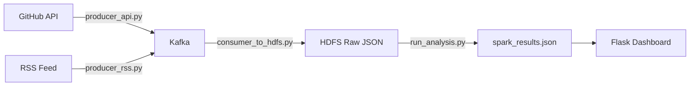
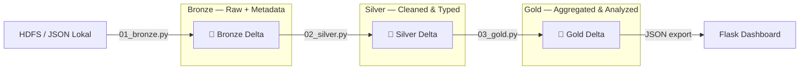

# 📦 GitTrend Data Lakehouse — Medallion Architecture

## Arsitektur

### Sebelum (ETS): Pipeline Batch Sederhana

**Masalah:** Data di HDFS berupa file JSON mentah tanpa skema, tanpa versioning, tanpa audit trail.

### Sesudah (Lakehouse): Medallion Architecture

**Keuntungan:** Setiap layer memiliki tujuan jelas, data terversioning (Time Travel), schema terkelola, dan audit trail lengkap.

---

## Transformasi Silver

### Silver API (5 Transformasi)

| # | Transformasi | Kolom | Justifikasi |
|---|-------------|-------|-------------|
| 1 | **Drop Duplikat** | `full_name` + `ingested_at` | Menghapus duplikat nyata dari multiple write ke HDFS, tapi mempertahankan observasi berbeda waktu (dibutuhkan untuk star_velocity) |
| 2 | **Parse Timestamp** | `ingested_at`, `created_at`, `pushed_at` | Mengkonversi string ISO → TimestampType agar bisa digunakan di Window function dan filter temporal |
| 3 | **Handle Null** | `language` → 'Unknown', filter `full_name` null | Repo tanpa nama tidak berguna; language null membingungkan analisis distribusi |
| 4 | **Ekstrak Jam** | `_hour` = hour(ingested_at) | Memungkinkan analisis temporal per jam (emerging_topics menggunakan cutoff berbasis waktu) |
| 5 | **Standarisasi** | trim(`full_name`, `description`) | Whitespace bisa menyebabkan false duplicate saat GROUP BY |

### Silver RSS (3 Transformasi)

| # | Transformasi | Kolom | Justifikasi |
|---|-------------|-------|-------------|
| 1 | **Drop Duplikat** | `link` | Setiap artikel memiliki URL unik |
| 2 | **Parse Timestamp** | `ingested_at` (ISO), `published` (RFC 2822) | Konversi ke TimestampType; RFC 2822 di-parse menggunakan UDF robust |
| 3 | **Handle Null** | Filter `title`/`link` null | Artikel tanpa judul atau URL tidak bisa ditampilkan |

### Schema Evolution (Bonus)

Kolom `_desc_length` ditambahkan ke Silver API menggunakan `mergeSchema`:
- **Batch 1** ditulis tanpa `_desc_length` (v0)
- **Batch 2** ditulis dengan `_desc_length` + `mergeSchema=true` (v1)
- Hasilnya: batch 1 memiliki `NULL` untuk `_desc_length`, batch 2 terisi

---

## Analisis Gold vs ETS Lama

| Analisis | ETS Lama (run_analysis.py) | Gold Layer (03_gold.py) | Perbedaan |
|----------|---------------------------|------------------------|-----------|
| **Distribusi Bahasa** | Python fallback, no typing | Spark SQL dengan GroupBy, tipe data benar | Gold: tipe timestamp tervalidasi, persentase akurat |
| **Top 10 Repo** | GROUP BY tanpa dedup di spark_analysis.py | GROUP BY + Window dedup konsisten | Gold: tidak ada duplikat, ranking eksplisit |
| **Star Velocity** | ❌ Tidak ada | ✅ Window function `lag()` | **Baru**: mendeteksi repo yang sedang viral berdasarkan perubahan star antar observasi |
| **Emerging Topics** | ❌ Tidak ada | ✅ Temporal keyword analysis | **Baru**: menemukan kata kunci yang baru muncul di data terbaru vs data lama |
| **Cross-Source** | ❌ Tidak ada | ✅ Join API topics ↔ RSS tags | **Bonus**: menemukan topik yang overlap antara GitHub repos dan berita TechCrunch |

---

## Time Travel

Demo Time Travel menunjukkan kemampuan Delta Lake menyimpan versi data:

| Versi | Operasi | Dibuat Oleh |
|-------|---------|-------------|
| v0 | Tulis batch 1 (overwrite) | `02_silver.py` |
| v1 | Append batch 2 + mergeSchema | `02_silver.py` (schema evolution) |
| v2 | Update `'Unknown'` → `'Not Specified'` | `03_gold.py` (time travel demo) |

**Perbandingan v1 vs v2:**
- v1: Masih ada `language = 'Unknown'`
- v2: Semua `'Unknown'` diubah menjadi `'Not Specified'`
- Data v1 tetap bisa diakses: `spark.read.format("delta").option("versionAsOf", 1).load(...)`

> **Screenshot:** _(Tambahkan screenshot output terminal setelah menjalankan pipeline)_

---

## Catatan Modifikasi `app.py`

> FAQ tugas menyatakan: "kode ETS yang lama tidak boleh dimodifikasi."

Endpoint lama (`/api/data`) **tidak diubah sama sekali**. Hanya **ditambahkan** endpoint baru
(`/api/gold`) yang membaca dari Gold Delta JSON exports. Ini bersifat **additive** —
menghapus endpoint baru tidak mempengaruhi fungsi dashboard yang sudah ada.

---

## Refleksi: Keuntungan Delta Lake vs HDFS/CSV

### 1. ACID Transactions
HDFS biasa rentan terhadap data korup jika proses menulis terganggu di tengah jalan.
Delta Lake menjamin **atomicity** — tulis berhasil sepenuhnya atau tidak sama sekali.

### 2. Time Travel (Versioning)
Dengan HDFS/CSV, data yang sudah dioverwrite hilang selamanya.
Delta Lake menyimpan **setiap versi**, memungkinkan audit, rollback, dan debugging data.

### 3. Schema Enforcement & Evolution
HDFS menerima file JSON dengan skema apapun tanpa validasi.
Delta Lake **menolak data** yang tidak sesuai skema (enforcement), dan mendukung
penambahan kolom baru secara aman (evolution via `mergeSchema`).

### 4. Unified Batch & Streaming
Delta Lake mendukung `mode("append")` yang kompatibel dengan Spark Structured Streaming.
Ke depannya, pipeline bisa diubah dari batch ke **near-real-time** tanpa mengubah format penyimpanan.

### 5. Metadata & Audit Trail
Kolom `_ingested_at` dan `_source` di Bronze memberikan **traceability** lengkap —
kita selalu tahu kapan dan dari mana data berasal.
